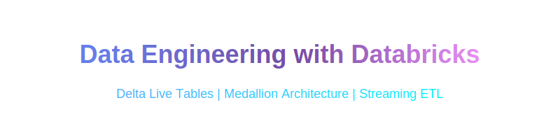

# Data Engineering with Databricks

<p align="center">
  <a href="https://ds500.paiml.com" title="Pragmatic AI Labs">
    
  </a>
</p>

[](https://www.python.org/downloads/)
[](LICENSE)
[](https://docs.databricks.com/en/delta-live-tables/index.html)

<p align="center">
  <strong>Hands-on labs for building data pipelines with Delta Live Tables and the medallion architecture</strong><br>
  Delta Live Tables | Expectations | Streaming | Medallion Architecture | CDC
</p>

> **FREE Databricks Edition:** All examples and labs in this course work with the [Databricks Community Edition](https://community.cloud.databricks.com/) (free). No paid account required.

---

## Table of Contents

- [Overview](#overview)
- [Quick Start](#quick-start)
- [Usage](#usage)
- [Capstone Project](#capstone-project)
- [Course Outline](#course-outline)
- [Project Structure](#project-structure)
- [Resources](#resources)
- [Coursera Marketing Assets](#coursera-marketing-assets)
- [Contributing](#contributing)
- [License](#license)

---

## Overview

Learn to build production data pipelines using Databricks. This course covers:

- **Delta Live Tables** — Declarative ETL pipelines with SQL and Python
- **Data Quality** — Expectations for validation, cleaning, and failure handling
- **Streaming** — Auto Loader for incremental file processing
- **Medallion Architecture** — Bronze, Silver, and Gold layers for organized data
- **Change Data Capture** — SCD Type 1 and Type 2 with `apply_changes()`

---

## Quick Start

1. Sign up for the [Databricks Community Edition](https://community.cloud.databricks.com/) (free)
2. Clone this repository:
   ```bash
   git clone https://github.com/alfredodeza/databricks-data-engineering.git
   ```
3. Upload example files from `examples/` to your Databricks workspace
4. Create a Delta Live Tables pipeline and point it to the uploaded file
5. Run the pipeline

> **Important:** All example files reference `/Volumes/workspace/default/` for data paths. You must update these paths to match your own workspace volume configuration.

---

## Usage

### Run Examples

Upload pipeline files to your Databricks workspace and create DLT pipelines:

| Example | Files | Description |
|---------|-------|-------------|
| DLT Basics | `examples/dlt-basics/my_transformation.sql` | SQL Bronze-Silver-Gold pipeline |
| Streaming | `examples/streaming/streaming_transformation.py` | Batch vs streaming with Auto Loader |
| Simple Pipeline | `examples/simple-pipeline/*.py` | Wine ratings with full medallion layers |
| Inventory System | `examples/wine-pricing-inventory/*.py` | End-to-end pipeline with CDC |

### Complete the Labs

| Lab | Topic | Examples |
|-----|-------|----------|
| [Lab 1](./labs/lab-1.md) | DLT Foundations | `dlt-basics/` |
| [Lab 2](./labs/lab-2.md) | Data Quality with Expectations | `dlt-basics/`, `simple-pipeline/` |
| [Lab 3](./labs/lab-3.md) | Streaming with DLT | `streaming/` |
| [Lab 4](./labs/lab-4.md) | Bronze Layer Fundamentals | `simple-pipeline/` |
| [Lab 5](./labs/lab-5.md) | Silver and Gold Layers | `simple-pipeline/`, `wine-pricing-inventory/` |
| [Lab 6](./labs/lab-6.md) | End-to-End Application | `wine-pricing-inventory/` |

### Capstone Project

After completing all labs, build your own production-style pipeline in the [Capstone Project](./docs/capstone-project.md). Choose a dataset and implement a complete medallion architecture with expectations, streaming, and CDC.

---

## Course Outline

### Module 1: Delta Live Tables Fundamentals
- [DLT Foundations](./examples/dlt-basics/) — Creating pipelines with SQL and Python
- [Data Quality with Expectations](./examples/simple-pipeline/) — Validation and constraint handling
- [Streaming with DLT](./examples/streaming/) — Auto Loader and incremental processing

### Module 2: Medallion Architecture
- [Bronze Layer](./examples/simple-pipeline/bronze.py) — Raw data ingestion from volumes
- [Silver Layer](./examples/simple-pipeline/bronze.py) — Data cleaning and normalization
- [Gold Layer](./examples/simple-pipeline/gold_by_region.py) — Business logic and aggregations

### Module 3: End-to-End Application
- [Wine Pricing Inventory](./examples/wine-pricing-inventory/) — Complete pipeline with CDC
- Capstone Project — Build your own pipeline

See the full [course outline](./docs/outline.md) for detailed lesson breakdowns.

---

## Project Structure

```
databricks-data-engineering/
├── examples/
│   ├── dlt-basics/              # SQL-based DLT pipeline
│   ├── streaming/               # Batch vs streaming ingestion
│   ├── simple-pipeline/         # Wine ratings Bronze-Silver-Gold
│   └── wine-pricing-inventory/  # End-to-end pipeline with CDC
├── labs/                        # Hands-on lab instructions
├── docs/                        # Course outline and capstone
└── tmp/                         # Original pipeline files (reference)
```

---

## Coursera Marketing Assets

This course is published on Coursera as part of the **Enterprise AI and Data Engineering with Databricks**
specialization. Marketing assets are generated using the
[resolve-pipeline](https://github.com/noahgift/resolve-pipeline) toolkit's Coursera slash commands.

### Generated Assets

| Asset | File | Description |
|-------|------|-------------|
| Landing page | `coursera-page.md` | Course name, description, FAQs, skill tags |
| About | `about-this-course.md` | Instructor bios, course structure, prerequisites |
| Next steps | `next-steps.md` | Follow-on course recommendations |
| Image prompts | `image-prompts.md` | Text prompts for AI image generators |
| Marketing banner | `marketing-image.svg` | 1200×600 course hero banner |
| Logo | `logo-image.svg` | 1000×1000 square course logo |
| Module banners | `module-{1,2,3}-banner.svg` | 1920×1080 per-module banners |
| Key terms | `{M.L}.0-key-terms.md` + SVG | 5 key terms per lesson with icon banner |
| Reflections | `{M.L}-reflection.md` + SVG | Key points, scenarios, journal prompt per lesson |
| Specialization | `specialization/coursera-specialization.md` | Specialization landing page |

### Regenerating Assets

From the `resolve-pipeline` directory:

```bash
# All assets use these common arguments:
#   config:     config/databricks_de.lua
#   source-dir: ~/src/databricks-data-engineering/coursera-assets/output
#   output-dir: /tmp/coursera-out

/coursera-page config/databricks_de.lua ~/src/databricks-data-engineering/coursera-assets/output /tmp/coursera-out
/coursera-keyterms config/databricks_de.lua ~/src/databricks-data-engineering/coursera-assets/output /tmp/coursera-out
/coursera-reflection config/databricks_de.lua ~/src/databricks-data-engineering/coursera-assets/output /tmp/coursera-out
```

---

## Resources

- [Databricks Documentation](https://docs.databricks.com/)
- [Delta Live Tables Guide](https://docs.databricks.com/en/delta-live-tables/index.html)
- [Databricks Community Edition (Free)](https://community.cloud.databricks.com/)
- [Delta Lake Documentation](https://docs.delta.io/)

**Related Courses:**

- [MLOps Specialization](https://www.coursera.org/specializations/mlops-machine-learning-duke)
- [Python for MLOps](https://www.coursera.org/learn/python-essentials-mlops-duke)

---

## Contributing

See [CONTRIBUTING.md](CONTRIBUTING.md) for guidelines.

1. Fork the repository
2. Create a feature branch
3. Submit a pull request

---

## License

Apache License 2.0 — see [LICENSE](LICENSE) for details.

---

<p align="center">
  Made with care by <a href="https://paiml.com">Pragmatic AI Labs</a>
</p>
